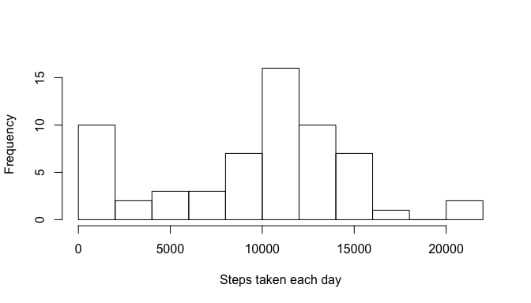
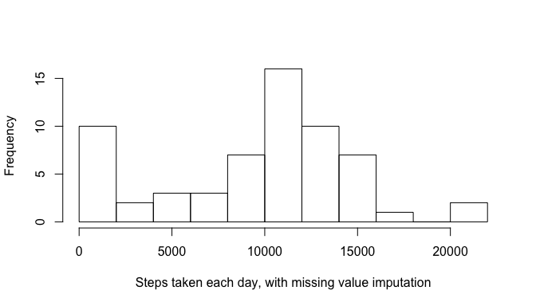
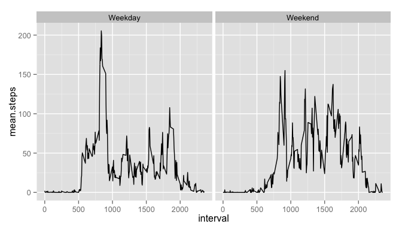

# Reproducible Research: Peer Assessment 1


## Loading and preprocessing the data

```r
library(ggplot2)
library(dplyr)
```

```
## 
## Attaching package: 'dplyr'
## 
## The following objects are masked from 'package:stats':
## 
##     filter, lag
## 
## The following objects are masked from 'package:base':
## 
##     intersect, setdiff, setequal, union
```

```r
if (!file.exists("activity.csv")) {   unzip("activity.zip")  }
activity.df <- read.csv("activity.csv", 
    colClasses = c("integer", "Date", "integer"))
activity.df <- tbl_df(activity.df)
```


## What is mean total number of steps taken per day?
Aggregate sum of all steps each day (removing NA values):

```r
daily.steps.summ <- activity.df %>% group_by(date) %>% 
    summarise(steps.per.day = sum(steps, na.rm = T))
```

- Plot a histogram of the total number of steps taken each day

```r
hist(daily.steps.summ$steps.per.day, breaks = 12, 
     xlab = "Steps taken each day", main = "")
```

 

- Find the mean and median total number of steps taken each day

```r
mean(daily.steps.summ$steps.per.day, na.rm = T)
```

```
## [1] 9354.23
```


```r
median(daily.steps.summ$steps.per.day, na.rm = T)
```

```
## [1] 10395
```


## What is the average daily activity pattern?
- Aggregate average of steps in each interval across all days

```r
interval.steps.summ <- activity.df %>% group_by(interval) %>%
    summarise(mean.steps = mean(steps, na.rm = T))
```

- Make a time series plot (i.e. type = "l") of the 5-minute interval (x-axis) and the average number of steps taken, averaged across all days (y-axis)

```r
ggplot(interval.steps.summ, aes(x = interval, y = mean.steps)) + geom_line()
```

 

- Which 5-minute interval, on average across all the days in the dataset, contains the maximum number of steps?

```r
arrange(interval.steps.summ, desc(mean.steps)) %>% slice(1)
```

```
## Source: local data frame [1 x 2]
## 
##   interval mean.steps
## 1      835   206.1698
```


## Imputing missing values
- Calculate and report the total number of missing values in the dataset (i.e. the total number of rows with NAs)

```r
activity.df %>% filter(is.na(steps)) %>% summarise(number.NA.rows = length(steps))
```

```
## Source: local data frame [1 x 1]
## 
##   number.NA.rows
## 1           2304
```

- Devise a strategy for filling in all of the missing values in the dataset. The strategy does not need to be sophisticated. For example, you could use the mean/median for that day, or the mean for that 5-minute interval, etc.

Will impute missing steps with the median for the same 5-minute interval.

- Create a new dataset that is equal to the original dataset but with the missing data filled in.

```r
median.int.df <- activity.df %>% group_by(interval) %>% 
	summarise(median.steps = median(steps, na.rm = T))
activity.imp.df <- left_join(activity.df, median.int.df, by = "interval")
activity.imp.df <- activity.imp.df %>% 
	mutate(steps = ifelse(is.na(steps), median.steps, steps)) 
```


- Make a histogram of the total number of steps taken each day and Calculate and report the mean and median total number of steps taken per day. Do these values differ from the estimates from the first part of the assignment? What is the impact of imputing missing data on the estimates of the total daily number of steps?

```r
daily.steps.imp.summ <- activity.imp.df %>% group_by(date) %>% 
    summarise(steps.per.day = sum(steps))

hist(daily.steps.imp.summ$steps.per.day, breaks = 12, 
     xlab = "Steps taken each day, with missing value imputation", main ="")
```

 

Mean total number of steps taken per day with imputation:

```r
mean(daily.steps.imp.summ$steps.per.day)
```

```
## [1] 9503.869
```
Median total number of steps taken per day with imputation:

```r
median(daily.steps.imp.summ$steps.per.day)
```

```
## [1] 10395
```

The mean total number of steps per day is slightly decreasd when imputing missing NA values; the median total number of steps per day is not affected.


## Are there differences in activity patterns between weekdays and weekends?
- Create a new factor variable in the dataset with two levels -- "weekday" and "weekend" indicating whether a given date is a weekday or weekend day.

```r
activity.imp.df <- activity.imp.df %>% 
    mutate(wkdy.wknd = weekdays(date)) %>%
    mutate(wkdy.wknd = 
        ifelse(wkdy.wknd %in% c("Saturday", "Sunday"), "Weekend", "Weekday"))
```

- Make a panel plot containing a time series plot (i.e. type = "l") of the 5-minute interval (x-axis) and the average number of steps taken, averaged across all weekday days or weekend days (y-axis).

```r
mean.daily.steps.wkdy.wknd <- activity.imp.df %>% 
    group_by(wkdy.wknd, interval) %>%
    summarise(mean.steps = mean(steps)) %>% ungroup()
    
ggplot(mean.daily.steps.wkdy.wknd, aes(x = interval, y = mean.steps)) + 
    geom_line() + facet_wrap(~ wkdy.wknd)
```

 


